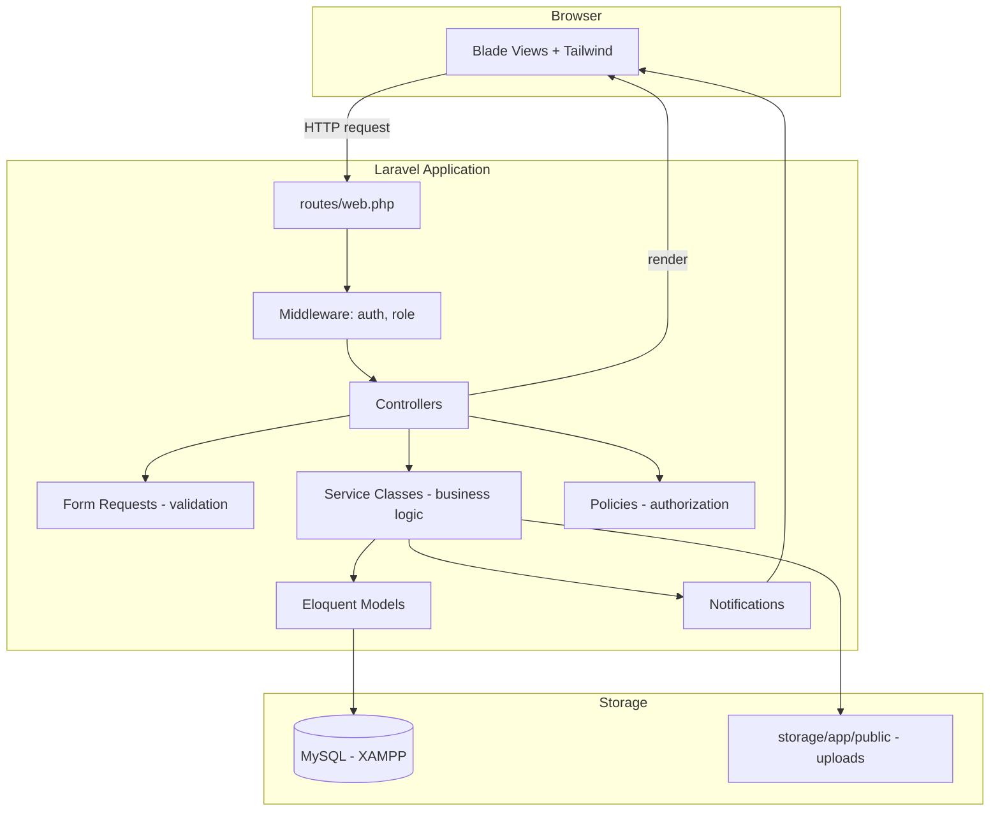
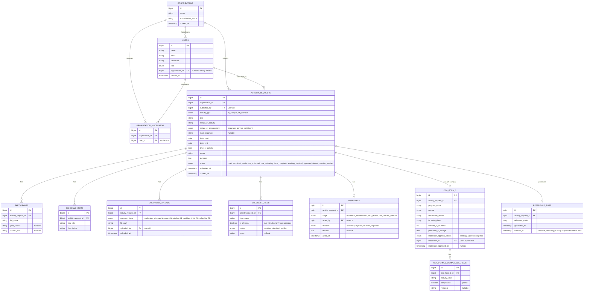

# OSA Activity Request & Document Tracking System
### Technical Architecture

**Stack:** Laravel · Blade + Tailwind CSS · MySQL (XAMPP, local)

---

## 1. Stack Overview

| Layer | Technology | Notes |
|---|---|---|
| Backend framework | Laravel (latest LTS) | MVC, routing, queueing, notifications, auth |
| Frontend | Blade templates + Tailwind CSS | Server-rendered views, no separate SPA/API frontend needed |
| Auth scaffolding | Laravel Breeze (Blade stack) | Login/registration, extended with role middleware |
| Database | MySQL via XAMPP | Local dev; `phpMyAdmin` for inspection, `.env` points to `127.0.0.1:3306` |
| File storage | Laravel local disk (`storage/app/public`) | Symlinked via `php artisan storage:link`; holds uploaded IDs, participant lists, schedules |
| Authorization | Laravel Policies + Gates (or `spatie/laravel-permission`) | Role-based access per Section 4 |
| Notifications | Laravel Notifications (database + mail channel) | In-app alerts now, email later if needed |
| PDF generation | `barryvdh/laravel-dompdf` (or similar) | For reference slips, OSA Form 3 printouts, pre-filled summaries |

This is a monolithic server-rendered app — no separate API layer required for v1. Controllers return Blade views directly.

---

## 2. High-Level Architecture



---

## 3. Roles & Access (maps to Section 4 of the Scope doc)

| Role | Laravel implementation | Access |
|---|---|---|
| Organization Officer | `users` row with `role = 'org_officer'`, linked to an `organizations` record | Submit/view requests for their org only |
| Moderator | `users` row with `role = 'moderator'`, linked to org(s) via `organization_moderator` pivot | Endorse requests, approve OSA Form 3, for assigned orgs only |
| OSA Admin | `users` row with `role = 'osa_admin'` | Full review queue, checklist verification, account/org management, document templates |
| OSA Director | `users` row with `role = 'osa_director'` | Final digital notation before physical signing stage |

Enforced via:
- Route middleware groups (`role:org_officer`, `role:moderator`, `role:osa_admin`, `role:osa_director`)
- `ActivityRequestPolicy` (view/update/endorse/approve gated per role + ownership)
- `spatie/laravel-permission` recommended over a raw enum column if roles/permissions are expected to grow (e.g., multiple moderators per org, delegated OSA Admin staff)

---

## 4. Database Schema (ERD)



Notes:
- `DOCUMENT_UPLOADS.document_type` deliberately excludes Parent's Consent and Medical Certificate — those never get a `file_path`, only a `CHECKLIST_ITEMS` row with `is_physical = true`.
- `CHECKLIST_ITEMS` is auto-seeded per `activity_type` when an `ACTIVITY_REQUESTS` row is created (service-layer logic, see Section 6).
- Certificate of Compliance is not a separate row — it's represented as one `CHECKLIST_ITEMS` entry tied to the Blue Form checklist group (per the "bundled with the Blue Form" revision).
- `OSA_FORM_3` has a single approval field (`moderator_approval_status`) — no Dean/Director/VP chain, per revision.

---

## 5. Laravel Project Structure

```
app/
├── Http/
│   ├── Controllers/
│   │   ├── Org/ActivityRequestController.php
│   │   ├── Org/DocumentUploadController.php
│   │   ├── Moderator/EndorsementController.php
│   │   ├── Moderator/OsaForm3ApprovalController.php
│   │   ├── OsaAdmin/ReviewQueueController.php
│   │   ├── OsaAdmin/ChecklistController.php
│   │   ├── OsaAdmin/OrganizationController.php   (admin/config)
│   │   ├── OsaDirector/NotationController.php
│   │   └── ReferenceSlipController.php
│   ├── Requests/
│   │   ├── StoreActivityRequestRequest.php
│   │   ├── UploadDocumentRequest.php
│   │   └── StoreOsaForm3Request.php
│   ├── Middleware/
│   │   └── EnsureUserHasRole.php
│   └── Policies/
│       ├── ActivityRequestPolicy.php
│       └── OsaForm3Policy.php
├── Models/
│   ├── Organization.php
│   ├── User.php
│   ├── ActivityRequest.php
│   ├── Participant.php
│   ├── ScheduleItem.php
│   ├── DocumentUpload.php
│   ├── ChecklistItem.php
│   ├── Approval.php
│   ├── OsaForm3.php
│   ├── OsaForm3ComplianceItem.php
│   └── ReferenceSlip.php
├── Services/
│   ├── ActivityRequestService.php     (create request, seed checklist)
│   ├── ChecklistService.php           (per-type checklist generation, completeness check)
│   ├── EndorsementService.php         (status transitions)
│   ├── ReferenceSlipService.php       (generate/claim reference codes)
│   └── PdfExportService.php           (OSA Form 3 printout, reference slip)
└── Notifications/
    ├── NewRequestAwaitingEndorsement.php
    ├── DocumentsMissing.php
    ├── PacketReadyForPhysicalStage.php
    └── StatusChanged.php

resources/
├── views/
│   ├── layouts/app.blade.php          (Tailwind shell, role-aware nav)
│   ├── org/dashboard.blade.php
│   ├── org/requests/create.blade.php
│   ├── org/requests/show.blade.php
│   ├── moderator/queue.blade.php
│   ├── moderator/osa-form-3.blade.php
│   ├── osa-admin/queue.blade.php
│   ├── osa-admin/checklist.blade.php
│   ├── osa-admin/organizations.blade.php
│   ├── osa-director/notation.blade.php
│   └── components/                    (status-badge, checklist-item, file-upload)
└── css/app.css                        (Tailwind entry)

database/
├── migrations/
└── seeders/
    └── ChecklistTemplateSeeder.php    (in-campus vs off-campus checklist templates)

routes/
└── web.php   (grouped by role prefix + middleware)
```

---

## 6. Key Workflows in Laravel Terms

**6.1 Submitting a Digital Activity Request**
`Org\ActivityRequestController@store` → `StoreActivityRequestRequest` validates → `ActivityRequestService::create()` creates `ACTIVITY_REQUESTS` row, saves `PARTICIPANTS`/`SCHEDULE_ITEMS`, and calls `ChecklistService::seedFor($request)` to auto-generate the right checklist rows (in-campus vs off-campus template) → status set to `submitted` → `NewRequestAwaitingEndorsement` notification fired to the assigned moderator.

**6.2 Moderator Endorsement**
`Moderator\EndorsementController@approve` → `EndorsementService::endorse()` inserts an `APPROVALS` row (`stage = moderator_endorsement`) → updates `ACTIVITY_REQUESTS.status = moderator_endorsed` → notifies OSA Admin.

**6.3 OSA Form 3 (Off-Campus Only)**
Org fills out `OsaForm3` + `OsaForm3ComplianceItems` digitally → routed directly to the assigned Moderator → `Moderator\OsaForm3ApprovalController@approve` sets `moderator_approval_status = approved`, `moderator_id`, `moderator_approved_at`. No further approval chain in-system.

**6.4 Document Checklist Completeness**
`ChecklistService::isComplete($request)` checks all `CHECKLIST_ITEMS` where `is_physical = false` have `status = submitted/verified`; physical items are tracked but don't block the "Digital Docs Complete" status — they block the later "Approved" status instead. When digital items are complete, status auto-advances to `docs_complete` and `PacketReadyForPhysicalStage` notifies OSA Admin.

**6.5 Physical Document Bridge**
`ReferenceSlipService::generate($request)` creates a `REFERENCE_SLIPS` row with a unique code once `docs_complete`. `PdfExportService` renders a printable slip. OSA Admin marks `claimed_at` when the org picks up the physical Pink/Blue form at the counter.

**6.6 Status Tracking Dashboard**
Both org and OSA Admin dashboards are just filtered/paginated `ActivityRequest::with(...)` queries against `status`, `organization_id`, `activity_type` — rendered via Blade + Tailwind tables/cards, no separate reporting service needed at this scale.

---

## 7. Local Environment (XAMPP)

- Start Apache is not required — Laravel uses its own dev server (`php artisan serve`) or you can point a XAMPP vhost at `public/`.
- Start **MySQL** in XAMPP control panel; create a database (e.g., `osa_system`) via phpMyAdmin.
- `.env`:
  ```
  DB_CONNECTION=mysql
  DB_HOST=127.0.0.1
  DB_PORT=3306
  DB_DATABASE=osa_system
  DB_USERNAME=root
  DB_PASSWORD=
  ```
- `php artisan migrate --seed` to build schema and load checklist templates.
- `php artisan storage:link` before testing uploads.

---

## 8. Deferred / Not in v1

- Queue workers for notifications (use `QUEUE_CONNECTION=sync` locally; revisit if email volume grows)
- API layer / mobile app (Blade-only for now)
- Multi-campus/branch support beyond the venue list in Section 4 of the form transcriptions
- Digital signature capture (e-signatures) for the moderator endorsement — v1 uses simple "Approve" button + audit log, not a cryptographic signature
